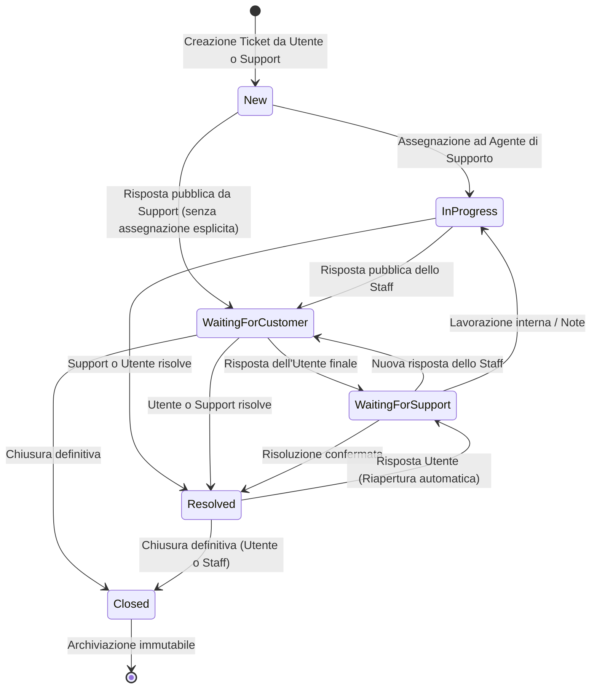
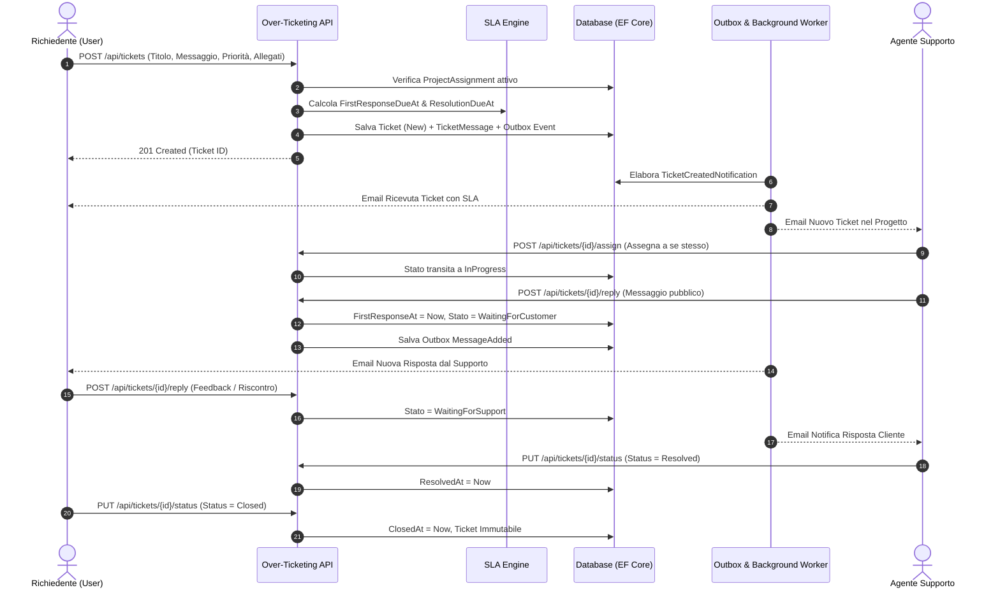

# Analisi Funzionale — Over-Ticketing API

Questo documento costituisce la specifica funzionale completa e dettagliata del sistema **Over-Ticketing API**, derivata dall'analisi del dominio, delle entità applicative, delle regole di business e delle API esposte.

---

## 1. Visione del Prodotto e Obiettivi del Sistema

**Over-Ticketing** è una piattaforma di Customer Support, Helpdesk e Knowledge Management concepita con un'architettura **multi-organizzazione** e **multi-progetto**. Il sistema consente a organizzazioni clienti di interagire con team di supporto strutturati attraverso:
- **Gestione strutturata dei ticket di assistenza** con tracciamento del ciclo di vita e conformità a stringenti Service Level Agreement (SLA).
- **Comunicazione a doppio binario** tra richiedente e supporto, con supporto a messaggi pubblici, note interne riservate allo staff e gestione allegati.
- **Knowledge Base gerarchica (Wiki)** a doppio livello (globale aziendale e specifica per progetto) con pubblicazione controllata e contenuti interni/pubblici.
- **Motore di notifiche email transazionali** basato su Outbox Pattern per la massima affidabilità.
- **Modello di sicurezza granulare** che combina ruoli globali (RBAC), autorizzazioni basate su permessi (PBAC) e assegnazioni di contesto per singolo progetto.

---

## 2. Attori del Sistema (Actors) e Modello di Sicurezza

Il sistema distingue chiaramente tra ruoli di identità globale e ruoli operativi contestuali al progetto.

### 2.1 Gli Attori

| Attore | Ruolo Tecnico | Descrizione & Ambito |
| :--- | :--- | :--- |
| **Amministratore Globale** | `Admin` | Gestore dell'intera piattaforma. Ha visibilità e controllo totale su tutte le organizzazioni, progetti, utenti, configurazioni globali, categorie e articoli wiki. Può forzare stati e assegnazioni su qualsiasi ticket. |
| **Agente di Supporto** | `Support` | Operatore tecnico incaricato della risoluzione dei problemi. Viene assegnato a uno o più progetti con ruolo di supporto. Gestisce i ticket del progetto (presa in carico, cambio stato, risposte, note interne), definisce categorie di progetto e redige articoli wiki specifici. |
| **Richiedente / Utente Finale** | `User` | Cliente, dipendente o utente finale che utilizza i prodotti dell'organizzazione. Deve essere assegnato a un progetto per interagire con esso. Può aprire ticket, consultare solo i propri ticket, inviare messaggi di replica, allegare file, consultare la Knowledge Base pubblica e chiudere/risolvere i propri ticket. |
| **Worker di Background (Sistema)** | `System` | Esecutore automatico di background (Outbox Publisher, Calcolatore SLA, Trigger di notifica). Non è un utente umano, ma agisce come attore transazionale asincrono garantendo la consegna di email ed elaborazione eventi. |

### 2.2 Modello di Accesso a Due Livelli (Global Role vs Project Role)

1. **Livello Piattaforma (ASP.NET Core Identity Roles & Permission Claims):**
   - Ruoli: `Admin`, `Support`, `User`.
   - All'utente `Admin` vengono attribuiti tutti i claim di permesso (`organizations:*`, `projects:*`, `users:*`, `tickets:*`, `wiki:*`, `categories:*`).
   - Gli utenti `Support` e `User` non possiedono permessi amministrativi globali di default; i loro poteri operativi effettivi sono controllati dalle assegnazioni sui singoli progetti.
2. **Livello Progetto (`ProjectAssignment`):**
   - Un utente non può accedere alle risorse di un progetto (ticket, categorie o wiki privato) se non possiede un'assegnazione attiva a quel progetto (`pa.ProjectId == targetProjectId && pa.UserId == currentUserId`).
   - Sull'assegnazione è specificato il ruolo di progetto (`User` o `Support`).
   - Regola di coerenza: un utente con ruolo globale `User` non può essere assegnato a un progetto con ruolo `Support`.

---

## 3. Modello Concettuale del Dominio (Domain Entities)

La gerarchia dei dati è strettamente strutturata:

```
[Organizzazione (Organization)]
       │
       └── 1:N ──> [Progetto (Project)]
                         │
                         ├── 1:N ──> [Assegnazione Utente (ProjectAssignment)] ──> [Utente (User)]
                         ├── 1:N ──> [Categoria Ticket (TicketCategory)] (Scope Progetto)
                         ├── 1:N ──> [Biglietto (Ticket)]
                         │                 │
                         │                 └── 1:N ──> [Messaggio (TicketMessage)]
                         │                                   │
                         │                                   └── 1:N ──> [Allegato (TicketAttachment)]
                         └── 1:N ──> [Articolo Wiki (WikiPage)] (Scope Progetto, Albero Gerarchico)
```

Inoltre, a livello di sistema esistono entità trasversali:
- **Categorie Globali (`TicketCategory` con `ProjectId = null`)**: Condivise tra tutti i progetti.
- **Wiki Globale (`WikiPage` con `ProjectId = null`)**: Base di conoscenza generale di piattaforma.
- **Impostazioni Utente (`UserSettings`)**: Preferenze per le notifiche email.
- **Token di Refresh (`RefreshToken`)**: Sessioni attive per rinnovo credenziali.
- **Messaggi Outbox (`OutboxMessage`)**: Eventi di dominio serializzati per pubblicazione affidabile.

---

## 4. Mappatura Dettagliata delle Feature

### Feature 1: Gestione Utenti, Autenticazione & Profilo

- **F1.1 Registrazione Self-Service (`/api/auth/register`):**
  - Consente la creazione di un account autonomo con attribuzione predefinita del ruolo `User`.
- **F1.2 Provisioning Utenti Amministrativo (`/api/users`):**
  - Gli amministratori possono creare account utente definendo nome, cognome, email e ruoli iniziali.
  - Il sistema genera automaticamente una password temporanea sicura e imposta il flag `MustChangePassword = true`.
  - Viene inviata una mail di benvenuto contenente le credenziali d'accesso temporanee.
- **F1.3 Autenticazione JWT & Refresh Token (`/api/auth/login`, `/api/auth/refresh-token`):**
  - Rilascio di token JWT con scadenza e Refresh Token persistito su database.
  - Meccanismo di rotazione del Refresh Token per impedire riutilizzi non autorizzati.
- **F1.4 Gestione Password & Reset:**
  - **Cambio Password Autonomo (`/api/auth/change-password`):** Obbligatorio al primo accesso se `MustChangePassword = true`, o su richiesta. Notifica di conferma via email.
  - **Password Dimenticata (`/api/auth/forgot-password` & `/api/auth/reset-password`):** Generazione token crittografico con invio email e schermata di reset.
  - **Reset Forzato da Admin (`/api/users/{id}/reset-password`):** Rigenerazione di una password temporanea con invio mail automatica.
- **F1.5 Profilo e Preferenze Utente (`/api/auth/me`, `/api/settings`):**
  - Consultazione dei propri dati anagrafici e ruoli.
  - Configurazione delle notifiche email personali:
    - Ricezione email alla creazione di nuovi ticket (`NotifyOnTicketCreated`).
    - Ricezione email all'aggiunta di messaggi/risposte sui ticket (`NotifyOnTicketReply`).
- **F1.6 Anagrafica Utenti:**
  - Ricerca paginata per nome o email (`/api/users`), visualizzazione dettaglio e cancellazione account.

---

### Feature 2: Gestione Organizzazioni (Multi-Tenancy)

- **F2.1 Anagrafica Organizzazione:**
  - Rappresenta l'entità aziendale/cliente di massimo livello.
  - Attributi: Nome, Logo (URL/Path), Stato (`Active`, `Archived`).
- **F2.2 Operazioni Amministrative (`/api/organizations`):**
  - Creazione e modifica dati aziendali.
  - Ricerca paginata con filtro testuale e stato.
  - Archiviazione logica (`Archive`) e ripristino (`Unarchive`).
  - Eliminazione definitiva (`Delete`), soggetta a verifiche di integrità referenziale sui progetti collegati.

---

### Feature 3: Gestione Progetti & Assegnazione Utenti

- **F3.1 Contenitore Progetto:**
  - Un progetto appartiene a una specifica organizzazione e raggruppa ticket, categorie dedicate e wiki.
  - Attributi: Nome, Descrizione, Stato (`Active`, `Archived`), FK `OrganizationId`.
- **F3.2 Ciclo di Vita del Progetto (`/api/projects`):**
  - Creazione progetto associato a un'organizzazione attiva.
  - Ricerca paginata con filtri per organizzazione, stato e testo libero.
  - Archiviazione e de-archiviazione: un progetto archiviato blocca la creazione e l'avanzamento dei ticket.
- **F3.3 Assegnazione Utenti al Progetto (`ProjectAssignment`):**
  - Associa un utente a un progetto con uno specifico ruolo contestuale (`User` o `Support`).
  - Validazione dei requisiti: l'utente deve possedere il ruolo Identity compatibile con il ruolo di progetto assegnato.
  - Invio automatico di una notifica email all'utente con il dettaglio del progetto e del ruolo assegnato.

---

### Feature 4: Tassonomia & Categorie di Ticket

- **F4.1 Modello Ibrido Globale / Progetto:**
  - **Categorie Globali (`ProjectId = null`):** Tassonomie trasversali fruibili da qualsiasi progetto, gestibili solo da Admin di sistema.
  - **Categorie di Progetto (`ProjectId != null`):** Categorie personalizzate create su misura per lo specifico progetto.
- **F4.2 Etichettatura Visiva:**
  - Ogni categoria supporta colori personalizzati esadecimali (`BackgroundColor`, `ForegroundColor`) per evidenziazione visuale nelle interfacce.
- **F4.3 Ciclo di Vita Categorie (`/api/categories`):**
  - Creazione (globale o per progetto), aggiornamento nome/colori, archiviazione logica e ripristino.
  - Quando una categoria è archiviata, non può essere selezionata per nuovi ticket o durante il cambio categoria.

---

### Feature 5: Gestione Ciclo di Vita dei Ticket

- **F5.1 Apertura Ticket (`/api/tickets` - POST):**
  - Il Richiedente (o lo Support per conto di un progetto) compila: Titolo, Priorità (`Low`, `Medium`, `High`, `Urgent`), Categoria (opzionale), Messaggio iniziale e allegati opzionali.
  - **Vincoli:** L'utente deve essere esplicitamente assegnato al progetto indicato. Il progetto deve essere attivo.
  - **Inizializzazione automatica:** Lo stato iniziale è `New`. Vengono calcolate le scadenze SLA in base alla priorità.
  - **Notifiche:** Invio email di conferma al richiedente e notifica allo staff di supporto assegnato al progetto.
- **F5.2 Consultazione & Filtri (`/api/tickets` - GET):**
  - **Isolamento per ruolo:**
    - L'utente standard vede **esclusivamente** i ticket aperti da lui stesso all'interno del progetto.
    - Lo staff di Supporto e gli Admin vedono **tutti** i ticket del progetto.
  - **Filtri disponibili:** Testo di ricerca su titolo, Stato, Priorità, Assegnatario (`AssignedToUserId`), Categoria.
  - Paginazione completa con metadati (`TotalCount`, `Page`, `PageSize`).
- **F5.3 Dettaglio Ticket (`/api/tickets/{id}`):**
  - Restituisce la scheda completa del ticket: stato, priorità, SLA calcolati, tempi effettivi, dettagli categoria e la sequenza cronologica dei messaggi.
  - **Filtro sicurezza messaggi:** Gli utenti finali non ricevono né vedono le note contrassegnate come interne.
- **F5.4 Assegnazione / Presa in Carico (`/api/tickets/{id}/assign`):**
  - Solo Support o Admin possono assegnare un ticket.
  - L'assegnatario deve essere un utente assegnato al medesimo progetto con ruolo `Support`.
  - **Regola di transizione:** Se il ticket si trova in stato `New`, l'assegnazione lo fa avanzare automaticamente a `InProgress`.
- **F5.5 Avanzamento di Stato (`/api/tickets/{id}/status`):**
  - Stati gestiti:
    1. `New`: Appena aperto, non ancora preso in carico né risposto.
    2. `InProgress`: Preso in carico da un agente.
    3. `WaitingForCustomer`: Il supporto ha risposto; si attende riscontro o azione del cliente.
    4. `WaitingForSupport`: Il cliente ha fornito informazioni o risposto; in attesa dell'agente.
    5. `Resolved`: Il problema è stato risolto con successo (`ResolvedAt` registrato).
    6. `Closed`: Chiusura definitiva del ciclo di vita (`ClosedAt` registrato). Nessun'altra azione consentita.
  - **Permessi stato:**
    - Support e Admin possono impostare qualunque stato.
    - L'utente richiedente può marcare il proprio ticket solo come `Resolved` o `Closed`.

---

### Feature 6: Conversazione, Note Interne & Allegati

- **F6.1 Risposta al Ticket (`/api/tickets/{id}/reply`):**
  - Supporta messaggi formattati in Markdown.
  - Se il ticket è in stato `Closed`, qualsiasi tentativo di risposta viene rigettato.
- **F6.2 Riservatezza & Note Interne (`IsInternal = true`):**
  - Riservate esclusivamente a Support e Admin. Permettono allo staff di scambiarsi commenti, diagnosi tecniche e appunti non visibili al cliente.
  - Un utente finale che tenta di pubblicare una nota interna riceve un errore di accesso non autorizzato.
  - Le note interne non generano mai notifiche email verso il cliente.
- **F6.3 Automatismi di Cambio Stato sulle Risposte:**
  - **Risposta pubblica di Support/Admin:**
    - Registra la data del primo riscontro (`FirstResponseAt = now`) se non già valorizzata.
    - Sposta automaticamente il ticket nello stato `WaitingForCustomer`.
  - **Risposta del Richiedente:**
    - Sposta automaticamente il ticket nello stato `WaitingForSupport`.
    - Se il ticket si trovava in stato `Resolved`, lo **riapre automaticamente**, azzerando il timestamp di risoluzione (`ResolvedAt = null`).
- **F6.4 Gestione Allegati (`TicketAttachment`):**
  - Possibilità di caricare uno o più file durante la creazione del ticket o nell'invio di risposte.
  - Storage sicuro con validazione del tipo MIME e dimensione.
  - Endpoint dedicato di download (`/api/tickets/{id}/attachments/{attachmentId}`) con verifica che il richiedente appartenga al progetto o sia proprietario del ticket.

---

### Feature 7: Motore SLA (Service Level Agreement)

Il sistema implementa una logica nativa di conformità ai tempi di servizio:

| Priorità | Scadenza Primo Riscontro (`FirstResponseDueAt`) | Scadenza Risoluzione (`ResolutionDueAt`) |
| :--- | :--- | :--- |
| **Urgent** | entro **1 ora** | entro **4 ore** |
| **High** | entro **4 ore** | entro **24 ore** (1 giorno) |
| **Medium** | entro **8 ore** | entro **48 ore** (2 giorni) |
| **Low** | entro **24 ore** (1 giorno) | entro **72 ore** (3 giorni) |

- **Calcolo all'apertura:** I limiti temporali vengono calcolati al momento esatto di creazione del ticket (`dateTimeProvider.UtcNow`).
- **Ricalcolo al cambio priorità (`/api/tickets/{id}/priority`):** Se un operatore varia la priorità del ticket, il sistema ricalcola dinamicamente le scadenze mantenendo come base temporale il timestamp di creazione originale (`CreatedAt`).
- **Tracciamento consuntivo:**
  - `FirstResponseAt`: Registrato al primo messaggio pubblico da parte di un membro dello staff.
  - `ResolvedAt`: Registrato quando il ticket raggiunge lo stato `Resolved` o `Closed`.

---

### Feature 8: Knowledge Base / Wiki

Modulo documentale per la condivisione di guide, procedure e risoluzioni autonome.

- **F8.1 Ambito Doppio (Globale vs Progetto):**
  - **Wiki Globale (`ProjectId = null`):** Visibile a livello trasversale per policy aziendali generali e guide di sistema. Modificabile unicamente da Admin globali.
  - **Wiki di Progetto (`ProjectId != null`):** Contenuti tecnici o funzionali dedicati allo specifico progetto. Gestibile da Support/Admin del progetto.
- **F8.2 Struttura Gerarchica e Navigazione:**
  - Supporto per albero documentale con relazione Padre-Figlio (`ParentPageId`).
  - Vincolo di integrità: una sottopagina di progetto non può essere agganciata a una pagina genitore globale, e viceversa.
- **F8.3 Risoluzione via Slug o GUID:**
  - Accesso intuitivo mediante slug SEO/Human-Friendly (generato automaticamente dal titolo o definito manualmente).
  - Slug univoco all'interno del proprio ambito di visibilità.
- **F8.4 Visibilità & Riservatezza (`IsInternalOnly` & Stati):**
  - Stati pagina: `Draft` (bozza), `Published` (pubblicato), `Archived` (archiviato).
  - Regola di lettura:
    - Agenti Support e Admin vedono tutti gli articoli (inclusi bozze, archiviati e interni).
    - Gli utenti finali possono consultare solo gli articoli in stato `Published` con `IsInternalOnly == false`.
    - Gli utenti non assegnati al progetto non possono leggere alcun articolo del relativo wiki.

---

### Feature 9: Sistema di Notifiche Email Transazionali

Tutte le notifiche vengono elaborate in modo asincrono e resiliente tramite domain events ed elaborazione Outbox.

- **F9.1 Eventi che scatenano email:**
  1. **Benvenuto Utente (`UserCreatedNotification`):** Invio credenziali temporanee.
  2. **Reimpostazione Password (`UserPasswordResetRequestedNotification`):** Invio token di recupero.
  3. **Conferma Password Modificata (`UserPasswordChangedNotification`):** Avviso di sicurezza all'utente.
  4. **Password Temporanea da Admin (`UserTemporaryPasswordAssignedNotification`):** Nuova password dopo reset forzato.
  5. **Assegnazione a Progetto (`UserAssignedToProjectNotification`):** Notifica del nuovo ruolo sul progetto con link diretto.
  6. **Apertura Ticket (`TicketCreatedNotification`):**
     - Al cliente: Ricevuta con ID, priorità e SLA attesi.
     - Allo staff di supporto del progetto: Notifica di nuovo ticket da lavorare (con fallback agli Admin se nessun supporto è assegnato).
  7. **Nuova Risposta sul Ticket (`TicketMessageAddedNotification`):**
     - Se risponde il supporto (pubblicamente): Notifica inviata al cliente con estratto del messaggio.
     - Se risponde il cliente: Notifica inviata a tutto lo staff di supporto del progetto.
- **F9.2 Rispetto delle Preferenze Utente:**
  - Prima di ogni invio su eventi ticket, il sistema interroga `UserSettings`. Se l'utente ha disabilitato `NotifyOnTicketCreated` o `NotifyOnTicketReply`, l'email viene soppressa per quell'utente.

---

## 5. Matrice Funzionale Attori / Azioni (RACI & Permessi)

| Entità / Area | Azione Funzionale | Admin | Support | User | Note Regole |
| :--- | :--- | :---: | :---: | :---: | :--- |
| **Organizzazioni** | Create, Update, Delete, Archive | **✓** | ✗ | ✗ | Esclusiva dell'amministratore |
| **Progetti** | Create, Update, Delete, Archive | **✓** | ✗ | ✗ | Esclusiva dell'amministratore |
| **Progetti** | Assegnazione Utenti (`ProjectAssignment`) | **✓** | ✗ | ✗ | Admin globale associa utenti e definisce ruoli |
| **Utenti** | Creazione, Gestione Ruoli, Reset Password | **✓** | ✗ | ✗ | Amministrazione centrale |
| **Utenti** | Registrazione autonoma, Profilo, Settings | **✓** | **✓** | **✓** | Tutti gli utenti autenticati |
| **Categorie** | Gestione Categorie Globali | **✓** | ✗ | ✗ | Visibili a tutti, modificate solo da Admin |
| **Categorie** | Gestione Categorie di Progetto | **✓** | **✓** | ✗ | Support/Admin assegnati al progetto |
| **Ticket** | Apertura Ticket | **✓** | **✓** | **✓** | Richiede assegnazione al progetto |
| **Ticket** | Elenco & Visualizzazione | Tutti | Tutti del Progetto | Solo Propri | Isolamento dati rigoroso per gli utenti |
| **Ticket** | Presa in carico / Assegnazione operatore | **✓** | **✓** | ✗ | Solo staff verso staff del progetto |
| **Ticket** | Risposta Pubblica | **✓** | **✓** | Solo Propri | Cambia stato in `WaitingForCustomer`/`WaitingForSupport` |
| **Ticket** | Aggiunta Nota Interna | **✓** | **✓** | ✗ | Invisibile al richiedente |
| **Ticket** | Modifica Priorità (e ricalcolo SLA) | **✓** | **✓** | ✗ | Solo staff autorizzato |
| **Ticket** | Risoluzione / Chiusura | **✓** | **✓** | Solo Propri | L'utente può solo segnare Resolved/Closed |
| **Allegati** | Upload e Download | **✓** | **✓** | Solo Propri | Download protetto da controllo di accesso |
| **Wiki** | Creazione/Modifica Wiki Globale | **✓** | ✗ | ✗ | Gestione centrale KB aziendale |
| **Wiki** | Creazione/Modifica Wiki Progetto | **✓** | **✓** | ✗ | Staff assegnato al progetto |
| **Wiki** | Consultazione Articoli | Tutti | Tutti del Progetto | Pubblicati & Non Interni | Utenti standard esclusi da bozze/interni |

---

## 6. Regole di Business Chiave (Business Rules & Invariants)

1. **BR-01 (Integrità del Progetto):** Non è possibile creare un ticket in un progetto archiviato (`Status == Archived`) o appartenente a un'organizzazione inesistente/archiviata.
2. **BR-02 (Appartenenza al Progetto):** Nessun utente (incluso lo staff di supporto) può creare ticket, rispondere o leggere ticket di un progetto a cui non sia preventivamente associato tramite `ProjectAssignment`.
3. **BR-03 (Isolamento del Richiedente):** Un utente con ruolo `User` può visualizzare e interagire esclusivamente con i ticket da lui aperti (`CreatedByUserId == currentUserId`).
4. **BR-04 (Immutabilità Ticket Chiusi):** Un ticket in stato `Closed` non accetta risposte, modifiche di stato, riassegnazioni, cambi di priorità o modifiche di categoria.
5. **BR-05 (Riapertura Automatica del Ticket):** Se un utente finale invia un messaggio di replica su un ticket che si trova in stato `Resolved`, il sistema lo riapre automaticamente impostando lo stato a `WaitingForSupport` e azzerando il timestamp `ResolvedAt`.
6. **BR-06 (Conformità SLA Dinamica):** Il calcolo degli SLA è deterministico sulla base della priorità. In caso di variazione della priorità prima della risoluzione, le scadenze `FirstResponseDueAt` e `ResolutionDueAt` vengono ricalcolate a partire dalla data di apertura originale (`CreatedAt`).
7. **BR-07 (Tracciamento Primo Riscontro):** Il campo `FirstResponseAt` viene fissato unicamente al primo messaggio pubblico inviato da un membro dello staff (`IsSupportOrAdmin == true` e `IsInternal == false`). Le note interne non incidono sul calcolo SLA.
8. **BR-08 (Riservatezza Note Interne):** Le note interne sono totalmente segregate: non vengono mai inviate via API al richiedente e non innescano mai notifiche email verso l'utente finale.
9. **BR-09 (Assegnatario Valido):** Un ticket può essere assegnato unicamente a un utente che possiede il ruolo `Support` o `Admin` nell'assegnazione dello specifico progetto.
10. **BR-10 (Gerarchia Wiki Consistente):** Una pagina Wiki non può avere come genitore una pagina appartenente a uno scope differente (es. padre Globale e figlio di Progetto, o viceversa).
11. **BR-11 (Unicità Slug):** Lo slug di una pagina Wiki deve essere univoco all'interno del proprio ambito (univoco tra le globali, o univoco all'interno del medesimo progetto).

---

## 7. Diagrammi dei Flussi Operativi

### 7.1 Macchina a Stati del Biglietto (Ticket Lifecycle)



---

### 7.2 Flusso Operativo di Apertura e Risposta


